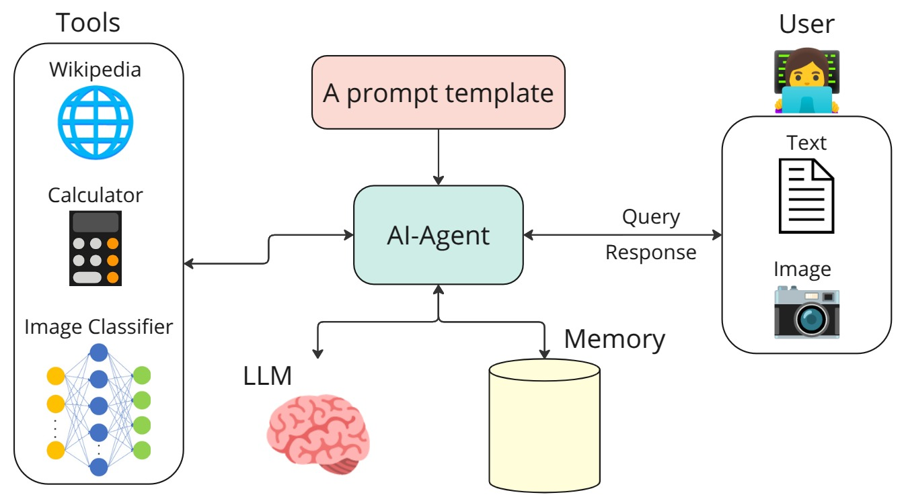
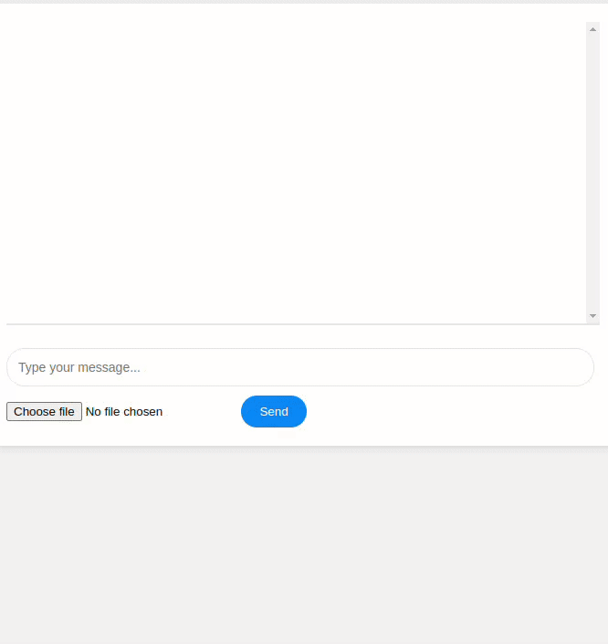

# AI Agent with Image Classification and Wikipedia Search tools

This repository contains a FastAPI-based AI agent that combines chat capabilities with image classification. The assistant uses the Mixtral-8x7B model from NVIDIA AI and includes tools for calculations, Wikipedia searches, and image classification.

## Diagram
<a name="top"></a>

<div align="left">

## Sample run demo

<div align="left">


## Features

- Interactive chat interface
- Image classification using Resnet18 encoder to classify: plane, car, bird, cat, deed, dog, frog, horse, ship, truck
- Calculator functionality
- Wikipedia search integration
- Web-based UI using FastAPI and Jinja2 templates


## Prerequisites

- Python 3.10+
- PyTorch
- FastAPI
- LangChain
- NVIDIA AI API key
- Uvicorn
- Wikipedia

## Project Structor
```bash
project_root/
│
├── assets/
│   ├── SampleRun.webm
│   └── AgentDiagram.jpg    
├── data/
│   ├── test_image1.jpeg
│   └── test_image2.jpeg
├── src/
│   ├── src/
│   ├── __init__.py
│   ├── agent.py
│   ├── utils.py
│   └── templates/
│       └── indexes.html
│── weights/
│   └── cifar_model.py        
├── README.md
├── Dockerfile
└── requirements.txt
```


## Installation

### To locally run the agent use the following steps

1. Clone the repository:
```bash
git clone https://github.com/YJonmo/AI_agent.git
cd AI_agent
```

2. Create a virtual env:
```bash
python3 -m venv .my_venv
souce .my_vent/bin/activate
pip install -r requirements.txt
```

3. Get an API key from [Nvidia website](https://build.nvidia.com/mistralai/mixtral-8x7b-instruct?snippet_tab=Python&signin=true&api_key=true) and place it in the src/agent.py:
```bash
os.environ["NVIDIA_API_KEY"] = "your-api-key-here" 
```

4.Run the agent locally:
```bash
uvicorn src.agent:app --host 0.0.0.0 --port 8000 --reload
```

5. Open a web browser at:
```bash
http://0.0.0.0:8080/
```

### You could build the docker image and deploy either locally or in the cloud

1. Build the docker image:
```bash
docker build -t ai_agent .
```

2. Run the docker image:
```bash
docker run -p 8080:8080 ai_agent
```

Optional: if you need GPU support then install NVIDIA Container Toolkit:
```bash
sudo apt-get install -y nvidia-container-toolkit
sudo systemctl restart docker
```
Run the docker image:
```bash
docker run --gpus all -p 8080:8080 ai_agent
```
